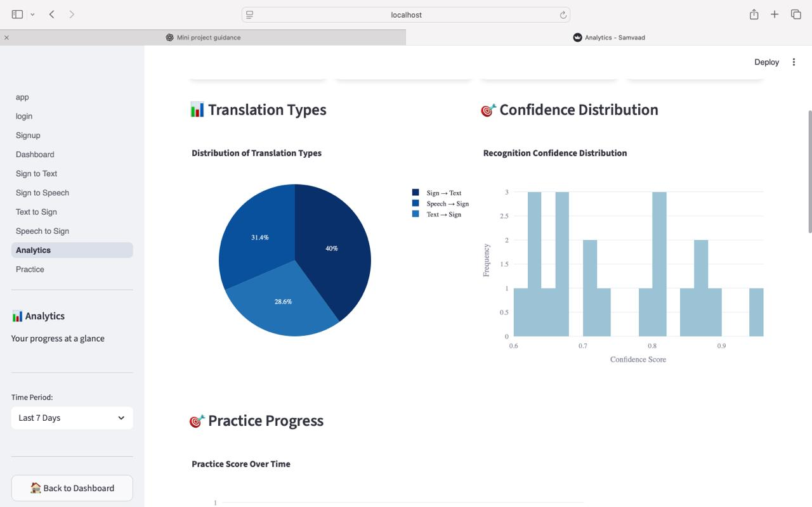

# 🧏‍♂️ Samvaad — Modular Multimodal Indian Sign Language Translator

## Overview
Samvaad is a **modular, AI-powered multimodal system** for real-time translation between **Indian Sign Language (ISL)**, **text**, and **speech**.  
The project integrates **Computer Vision**, **Deep Learning**, and **Speech Processing** to enable inclusive communication between the Deaf community and non-signers.

---

## Motivation
Indian Sign Language (ISL) is widely used by the Deaf community, yet accessibility tools remain limited, fragmented, or one-directional.

This project aims to:
- Enable **bidirectional communication**
- Support **real-time translation**
- Provide **learning and practice tools**
- Offer **analytics-driven insights**

---

## System & Hardware
- **Input Modalities:** Webcam, Image Upload, Microphone, Text  
- **Core Techniques:** Hand Landmark Detection, Deep Learning Classification  
- **Deployment:** Local Streamlit Application  
- **Hardware:** Standard laptop webcam and microphone  

---

## Translation Modes & Capabilities

| Mode | Description |
|-----|------------|
| Sign → Text | Converts hand gestures into readable English text |
| Sign → Speech | Converts recognized signs into natural speech |
| Text → Sign | Displays corresponding ISL sign visuals |
| Speech → Sign | Converts live speech into ISL signs |
| Practice Mode | Interactive ISL learning |
| Analytics Dashboard | Accuracy, confidence & usage tracking |

---

## Model & Training
- **Landmarks:** MediaPipe Hands (21 × 3)
- **Model:** Dense Neural Network with Dropout
- **Classes:** 36 (A–Z + 0–9)
- **Framework:** TensorFlow / Keras

---

## Processing Pipeline
1. Frame capture (Webcam / Image)
2. Hand landmark detection
3. Feature normalization
4. Model inference
5. Output rendering (Text / Speech / Sign)

---

## Analytics Dashboard

Tracks:
- Prediction confidence
- Practice accuracy
- User activity timeline
- Learning progress

---

## Practice Mode

Supports:
- Text → Sign
- Sign → Text
- Accuracy tracking
- Attempt history

---

## Sign → Text Translation

*Real-time ISL alphabet recognition using MediaPipe hand landmarks and a deep learning classifier.*

---

## Project Structure
Samvaad/
├── app/
├── data/
├── outputs/
├── screenshots/
├── requirements.txt
└── README.md

---

## Limitations
- Static gestures only
- No sentence-level recognition
- Lighting dependent
- Local deployment

---

## Future Work
- Continuous gesture recognition
- LSTM / Transformer-based sentences
- Mobile deployment (TFLite)
- Cloud hosting

---

## Technologies Used
Python, TensorFlow, MediaPipe, OpenCV, Streamlit, SpeechRecognition, SQLite

---

## Authors
**Srishti Sindgi** 
GitHub: https://github.com/sindgisrishtis

**Ujwala Shet**
GitHub: https://github.com/ujwalashet

**Sanjana R**
GitHub: https://github.com/r-sanjana
